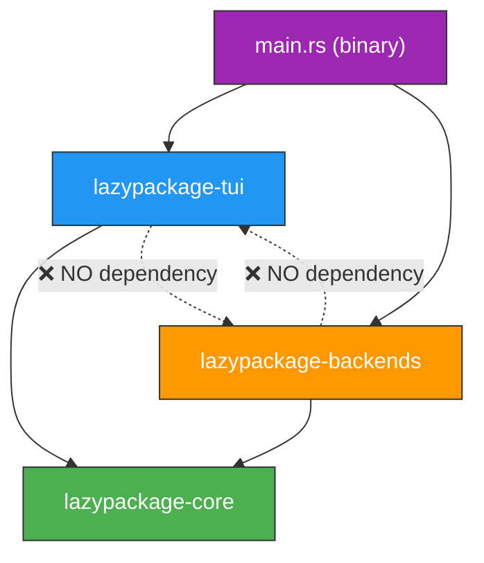
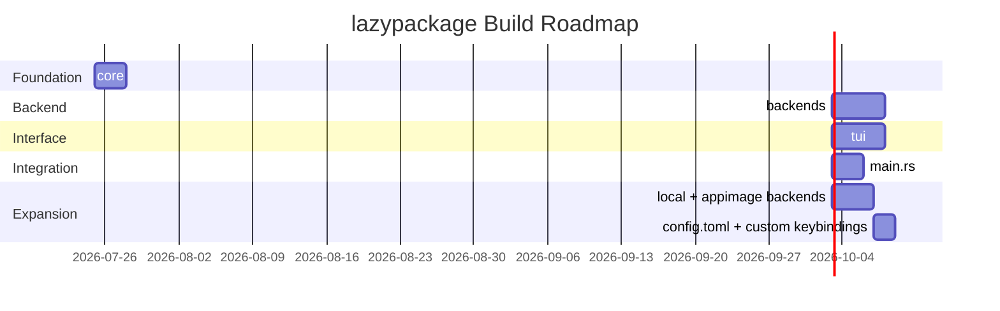
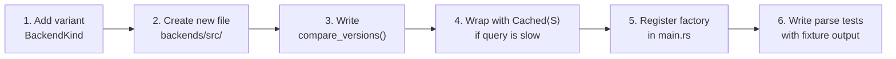

# Architecture Overview — lazypackage

> **Living Document** · Last updated: 2026-07-25
>
> The single source of truth for all high-level design decisions.

---

## Core Principles

| #   | Principle                                  | Explanation                                                                                                                         |
| --- | ------------------------------------------ | ----------------------------------------------------------------------------------------------------------------------------------- |
| 1   | **Module boundaries enforced by compiler** | Use Cargo workspace + visibility (`pub`, `pub(crate)`), do not rely on "don't import that" conventions.                             |
| 2   | **No storing derived data**                | Package status (`Installed`/`UpgradeAvailable`/`NotInstalled`) is always computed from the version, not stored in a separate field. |
| 3   | **Side effects are data, not closures**    | The `Command` enum represents side-effects to make `update()` testable without running real commands.                               |
| 4   | **Each backend owns its own logic**        | Version comparison, privilege calling method — do not force a shared algorithm at the core layer.                                   |
| 5   | **UI only reads `AppState`**               | Absolutely do not call backends directly. Backend and TUI do not depend on each other.                                              |

---

## Workspace Structure

```
lazypackage/
├── Cargo.toml                       # workspace root
├── crates/
│   ├── core/                        # lazypackage-core
│   │   └── src/
│   │       ├── domain.rs            # Package, PackageId, BackendKind...
│   │       ├── traits.rs            # PackageSource, Installer, PrivilegeEscalator
│   │       └── action.rs            # Action, Command (shared between update ↔ ui)
│   ├── backends/                    # lazypackage-backends
│   │   └── src/
│   │       ├── dnf.rs
│   │       ├── local.rs
│   │       ├── appimage.rs
│   │       ├── process.rs           # Shared executor, wraps tokio::process
│   │       ├── privilege.rs         # PkexecEscalator, SudoEscalator
│   │       └── cache.rs             # Cached<S: PackageSource> decorator
│   └── tui/                         # lazypackage-tui
│       └── src/
│           ├── layout.rs
│           ├── theme.rs
│           ├── components/          # each widget impls Component trait
│           │   ├── sidebar.rs
│           │   ├── package_table.rs
│           │   ├── details_pane.rs
│           │   └── log_panel.rs
│           └── update.rs            # update(state, action) -> Vec<Command>, pure fn
└── src/
    └── main.rs                      # binary: setup tokio + terminal, wiring, panic hook
```

### Dependency Direction (Required)

`main.rs` → `{tui, backends}` → `core`.
`tui` and `backends` do **not** depend on each other — they only communicate via `core::Action`/`core::Command` passed through the event channel in `main.rs`.
`core` does not depend on `tokio`, `ratatui`, or `crossterm`.



### Crate Responsibilities

| Crate      | Responsibilities                                       | Must Not Do                               |
| ---------- | ------------------------------------------------------ | ----------------------------------------- |
| `core`     | Domain types, traits (ports), `Action`/`Command` enums | I/O, specific async runtime, drawing UI   |
| `backends` | Implement `core` traits for dnf/local/appimage         | Know about ratatui, know about `AppState` |
| `tui`      | Render `AppState`, generate `Action` from key presses  | Call `backends::dnf::*` directly          |
| `main.rs`  | Event loop (`tokio::select!`), wiring, panic hook      | Contain business logic                    |

---

## Recommended Build Order



| Phase            | Description                                                           | Completion Criteria                                    |
| ---------------- | --------------------------------------------------------------------- | ------------------------------------------------------ |
| **1. core**      | `cargo new --lib` — domain types + traits + `Action`/`Command`        | Build passes, only requires `async-trait`, `thiserror` |
| **2. backends**  | Implement `dnf` (primary backend), test parsing with fixtures         | `cargo test -p lazypackage-backends` passes            |
| **3. tui**       | Build static layout, use mock `AppState`                              | Renders correctly on TestBackend                       |
| **4. main.rs**   | Event loop wiring, panic hook, connect `tui` + `backends` via channel | App runs, installs/removes packages via dnf            |
| **5. Expansion** | Add `local`, `appimage` after main loop stabilizes                    | Test fixtures for each backend                         |
| **6. Config**    | Add `config.toml` + custom keybindings                                | Config parsing, keybindings working                    |

---

## Checklist for Adding a New Backend (apt, pacman, flatpak, snap)



1. **Add variant** to `BackendKind`.
2. **Create new file** in `crates/backends/src/`, implement appropriate `PackageSource`/`Installer` (not necessarily both).
3. **Write `compare_versions`** specific to that backend — **do not reuse** another backend's algorithm.
4. **Wrap with `Cached<S>`** if queries are slow.
5. **Register** in the factory function returning `Vec<Box<dyn PackageSource>>` in `main.rs` — this is the **only place** that knows about the concrete backend types, `tui` never sees them.
6. **Write tests** for parsing using real tool fixture outputs.

---

## Links

**Architecture Documents:**

- [Domain Model](domain-model.md)
- [TEA Runtime](tea-runtime.md)
- [Error Handling](error-handling.md)

**Specs Documents:**

- [Backend Specification](../specs/backend-spec.md)
- [TUI Specification](../specs/tui-spec.md)
