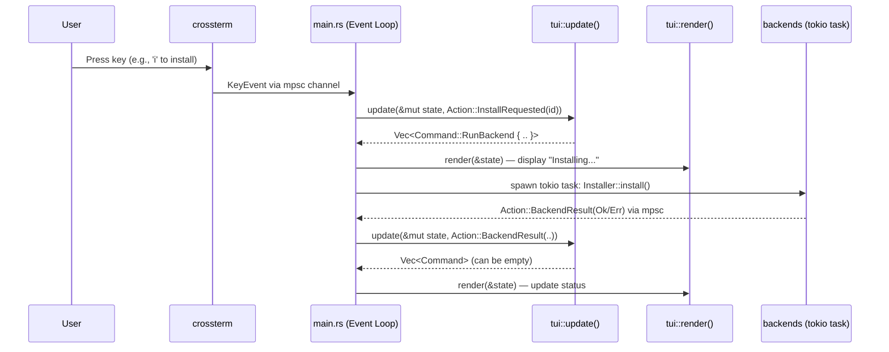

# TEA Runtime Architecture — lazypackage

> **Living Document**

This architecture is based on The Elm Architecture (TEA).

## General Event Flow

```
Keyboard (crossterm) ─┐
                       ├─▶ Event channel (mpsc) ─▶ update(state, action) ─┬─▶ AppState ─▶ render (tui)
Backend Results ───────┘                                                  └─▶ Command ─▶ PackageSource/Installer (backends)
```

## Sequence Diagram



## Action & Command Enums

```rust
// core::action
pub enum Action {
    KeyPressed(KeyEvent),
    SearchChanged(String),
    BackendResult(BackendKind, Result<Vec<Package>, String>),
    InstallRequested(PackageId),
}

pub enum Command {
    RunBackend { backend: BackendKind, op: BackendOp },
    Quit,
}
```

## Important Rules

- **`update()` is a pure function**: receives `Action`, returns `Vec<Command>`, mutates `&mut AppState`. It does not spawn tasks or call backends itself — that is executed by `main.rs` after receiving `Command`.
- **`Command` is a data enum** for testability: assert that `update()` generates the correct `Command::RunBackend { .. }` without running real `dnf`.
- **`main.rs`** runs `tokio::select!` between `crossterm::event` and `mpsc::Receiver<Action>` — merging into a single `Action` stream.
- Each widget in `tui/components` implements a common **`Component { handle_key, update, draw }`** trait to manage local state (scroll offset, search buffer) without leaking into the global `AppState`.

---

## Configuration (`~/.config/lazypackage/config.toml`)

```toml
[general]
default_backend = "dnf"
cache_ttl_seconds = 300

[privilege]
method = "pkexec"        # "pkexec" | "sudo"

[keybindings]
navigate_down = "j"
navigate_up = "k"
install = "i"
search = "/"
quit = "q"
```

Parsed with `serde` + `toml`, the `Config` struct lives in the binary (no need to put it in `core`).

> See details in [Configuration Guide](../guides/configuration.md).

---

## TUI Design (reference for `tui` crate)

**Overall layout:** top bar → 3 columns (category sidebar | package table | details pane) → command log line → footer keybinds.

```
┌─────────────────────────────────────────────────────────┐
│  lazypackage                              ? help       │  ← Top bar
├──────────┬──────────────────────┬───────────────────────┤
│          │                      │                       │
│ Sidebar  │    Package Table     │    Details Pane       │
│ (category│    (package list)    │    (details tab)      │
│  list)   │                      │                       │
│          │                      │                       │
├──────────┴──────────────────────┴───────────────────────┤
│  $ dnf install nodejs                            [OK]   │  ← Log panel
├─────────────────────────────────────────────────────────┤
│  j/k: navigate  i: install  /: search  q: quit       │  ← Footer
└─────────────────────────────────────────────────────────┘
```

| Principle         | Details                                                                                                                           |
| ----------------- | --------------------------------------------------------------------------------------------------------------------------------- |
| **Icons**         | Use Nerd Font glyphs or 1-width Unicode symbols (`●○▲`), **no colored emojis** — widths are inconsistent across terminal fonts    |
| **Focus state**   | Focused panel has an accent colored border (2px), other panels have a light gray border                                           |
| **Package table** | `ratatui::Table` with fixed `Constraint` for each column, right-aligned versions, add Repo column                                 |
| **Status**        | Monotone colors + symbols: 🟢 green = installed, 🟡 yellow = upgradable, ⚪ gray = absent — do not use `I/U/-` letters            |
| **Multi-select**  | Separate checkboxes with status badges — do not merge the two roles into one symbol                                               |
| **Details tab**   | Use the built-in `ratatui::Tabs` widget, do not draw nested boxes manually                                                        |
| **Log panel**     | 1 line showing the actual system command running (`$ dnf install nodejs`) — mandatory because sudo operations must be transparent |
| **Top bar**       | Remove version number, save space for `? help` hint or dynamic statuses                                                           |

---

## Testing per Crate

| Crate      | Testing Approach                                                                                             |
| ---------- | ------------------------------------------------------------------------------------------------------------ |
| `core`     | Pure unit tests, no I/O                                                                                      |
| `backends` | Inject fake `PrivilegeEscalator`/command runner, test parsing with real fixture text outputs from `dnf list` |
| `update()` | Golden tests: feed in `Action`, assert resulting `AppState` + generated `Vec<Command>`                       |
| `tui`      | `ratatui::backend::TestBackend` + `insta` snapshot tests for render buffers                                  |
